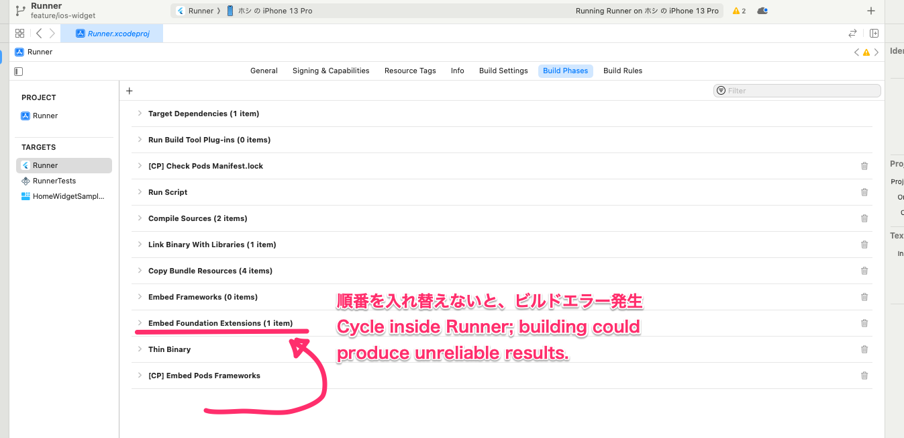

# home_widget_sample

A new Flutter project.

## Xcode15で発生するビルドエラー

Runnerの`Build Phases`にて、以下のように設定を変更しないとビルドエラーが発生する様子

[こちらを参考にした](https://scrapbox.io/yuki-2021/xcode15%E3%81%A7%22Error_(Xcode):_Cycle_inside_Runner;_building_could_produce_unreliable_results.%22_%E3%82%A8%E3%83%A9%E3%83%BC%E3%81%8C%E5%87%BA%E3%82%8B%E6%99%82)
